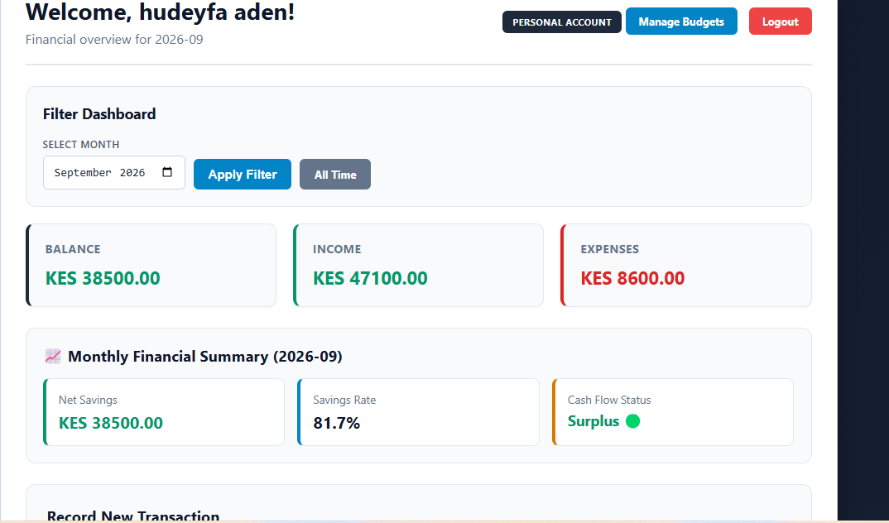
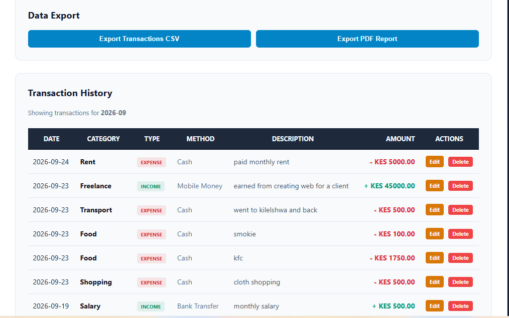
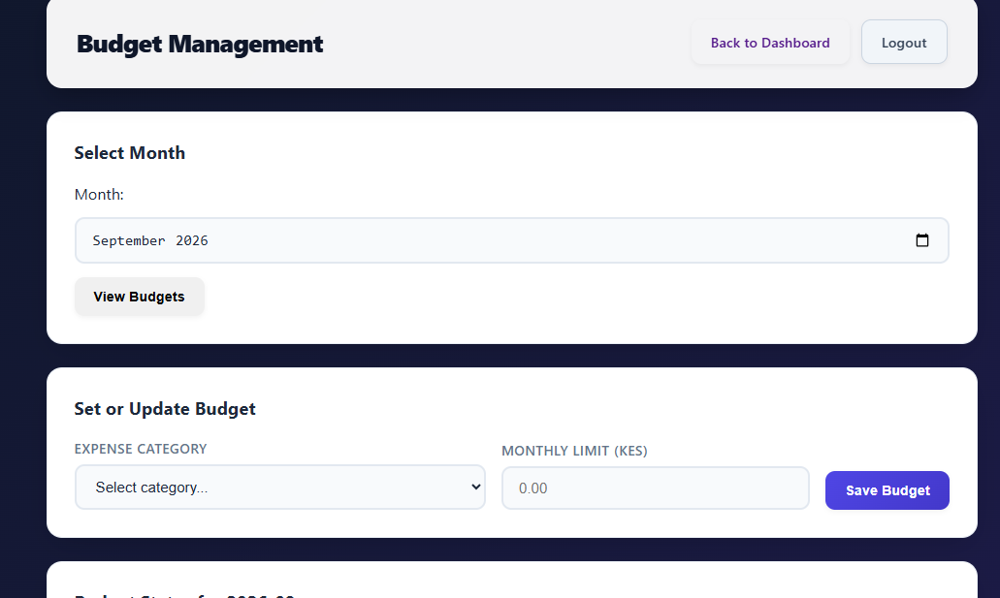
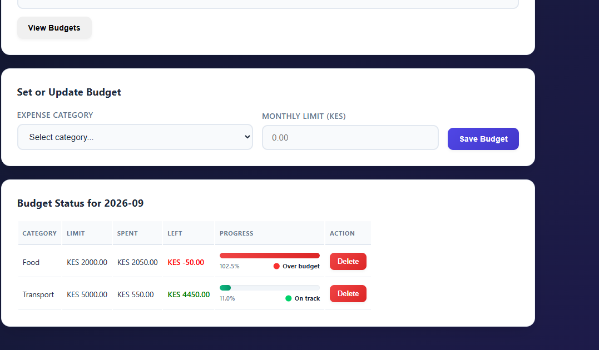
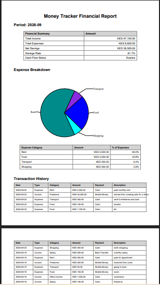

# Money Tracker

A Flask-based web application for personal users and small businesses to record, organize, monitor, and understand their finances.

## Overview

Money Tracker is a practical finance-tracking application that combines my interests in **Finance and Information Technology**.

The application is designed around a simple workflow:

**Record → Organize → Calculate → Understand**
## Application Screenshots

### Dashboard


### Transaction Management


### Budget Management


### Budget Management


### Financial Report


It allows users to record income and expenses, organize transactions into categories, monitor financial performance, set monthly spending limits, and generate financial reports.

The project is intentionally focused on practical money tracking and financial awareness rather than functioning as a full double-entry accounting system.

## Live Demo

🌐 **Live Application:**  
https://zackyman.pythonanywhere.com/

## Features

### User Management
- User registration
- User login and logout
- Password hashing
- Personal and business account types

### Transaction Management
- Record income
- Record expenses
- Categorize transactions
- Edit transactions
- Delete transactions
- View transaction history
- Search and filter transactions

### Financial Dashboard
- Total income
- Total expenses
- Net cash flow
- Monthly financial summaries
- Savings rate
- Surplus/deficit status
- Expense category breakdown
- Expense visualization using Chart.js

### Budget Management
- Create monthly category budgets
- Set spending limits
- Monitor spending against limits
- Identify categories that are approaching or exceeding their limits

Budget status is displayed as:

- **On Track** — below 80%
- **Near Limit** — 80–99%
- **Over Budget** — 100% or more

### Financial Reports
- Export transactions to CSV
- Generate PDF financial reports
- Expense category analysis
- Transaction history included in PDF reports

## Technology Stack

| Technology | Purpose |
|---|---|
| Python | Application logic |
| Flask | Web application framework |
| SQLite | Database |
| HTML | Page structure |
| CSS | User interface styling |
| JavaScript | Client-side functionality |
| Chart.js | Financial visualization |
| ReportLab | PDF report generation |

## System Architecture

The application follows a simple web application architecture:

```text
User
  ↓
Web Browser
  ↓
HTML / CSS / JavaScript
  ↓
Flask Application
  ↓
Database Layer
  ↓
SQLite Database
Financial Data Handling

Money is stored in the database as integer cents rather than floating-point numbers.

For example:

KES 1,500.50
      ↓
150050 cents

This approach helps avoid common floating-point precision issues when handling monetary values.

For personal users, the application uses net cash flow / money remaining rather than presenting the result as formal accounting profit.

Database

Money Tracker uses SQLite for data storage.

The application stores information related to:

Users
Categories
Transactions
Budgets

The database file is intentionally not included in this public repository because it can contain user and financial transaction data.

Security

The application includes:

User authentication
Password hashing
User-specific transaction access
User-specific category and budget data

Sensitive configuration such as application secrets should not be stored directly in the public repository.

Project Structure
money-tracker/
│
├── app.py
├── database.py
├── requirements.txt
├── .gitignore
│
├── templates/
│   ├── index.html
│   ├── login.html
│   ├── register.html
│   ├── dashboard.html
│   ├── edit_transaction.html
│   └── budgets.html
│
└── static/
    ├── css/
    │   └── style.css
    └── js/
        └── script.js
Running the Project Locally
1. Clone the repository
git clone https://github.com/YOUR-USERNAME/money-tracker.git
cd money-tracker
2. Create a virtual environment
python -m venv venv
3. Activate the virtual environment

Windows:

venv\Scripts\activate
4. Install dependencies
pip install -r requirements.txt
5. Run the application
python app.py

Then open the local Flask address shown in the terminal.

Deployment

The application has been deployed and tested using PythonAnywhere.

The live deployment was tested with:

User authentication
Income and expense recording
Dashboard calculations
Transaction history
Budget management
CSV export
PDF reporting
Project Purpose

This project is part of my broader Finance + IT portfolio.

The goal is to demonstrate the ability to combine:

Finance knowledge
Software development
Data handling
Business thinking
User-focused workflows
Practical problem solving

Rather than building a purely technical demonstration, the project focuses on solving a practical financial tracking problem through software.

Limitations

Money Tracker is not intended to replace a full accounting system.

It does not currently implement:

Full double-entry accounting
General ledger accounting
Financial statements for formal accounting purposes
Tax accounting
Multi-user business accounting workflows

These areas could be addressed in future projects or future versions of the application.

Future Improvements

Potential future improvements include:

PostgreSQL database support
More advanced financial analytics
Additional financial reports
Improved mobile responsiveness
More advanced budgeting tools
Recurring transactions
Additional dashboard visualizations
Enhanced security and production hardening
Project Status

Completed and deployed.

The application is currently available as a live web application.

Author

Zack

Finance & IT student building practical projects at the intersection of:

Finance × Technology × Data × Business
